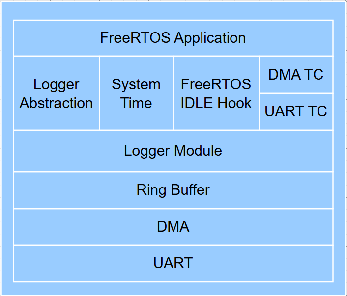
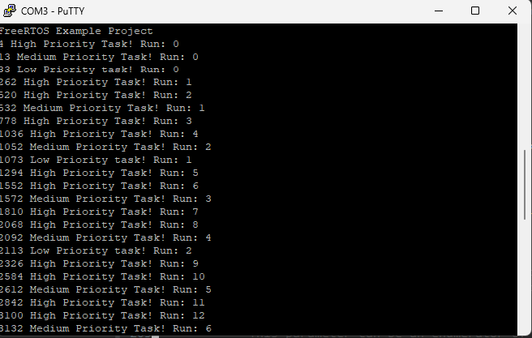

# 🧾 Asynchronous Ring Buffer Logger for FreeRTOS
 
A **low-latency, thread-safe logging module** for FreeRTOS-based embedded applications.  
Logs are written to a ring buffer and flushed asynchronously via **UART + DMA** — keeping real-time task behaviour unaffected.
 
<p align="center">
  
</p>

---
 
## ✨ Key Features
 
- **Asynchronous** — log calls return immediately; transmission happens in the background
- **Thread-safe** — FreeRTOS mutex protects shared buffer writes
- **Hardware-agnostic** — UART/DMA backend abstracted via function pointers; easy to port
- **CPU-efficient** — log flushing triggered from FreeRTOS Idle Hook, zero impact on active tasks
- **SEGGER SystemView** integration for real-time task profiling
 
---
 
## 🚀 Quick Start
 
**Tested on:** STM32L475 (B-L475E-IOT01A1) with STM32CubeIDE
 
1. Clone this repository:
   ```bash
   git clone https://github.com/nh-ee/logger-rb-freertos.git
   ```
2. Open the project in **STM32CubeIDE**: `File → Open Projects from File System` → select the `STM32CubeIDE/` folder
3. Build and flash to your board (`Run → Debug`)
4. Open a serial terminal (e.g. PuTTY or CubeIDE console) at **115200 baud**
5. Logger output appears automatically on UART:
 
<p align="center">
  
</p>

---

## 🏗️ Architecture Highlights
 
| Component | Role |
|---|---|
| **Ring Buffer** | Temporary log storage; decouples producers from the UART backend |
| **FreeRTOS Mutex** | Protects concurrent write access from multiple tasks |
| **UART + DMA** | Non-blocking log transmission; CPU is free during transfer |
| **Idle Hook** | Triggers `app_log_process()` when CPU is idle — zero overhead during active tasks |
| **Function Pointers** | Decouple logger core from hardware drivers; swap backends without changing logger code |
 
---
 
## 🛠️ How to Integrate Into Your Own Project
 
### Step 1 — Add required source files
 
| File | Purpose |
|---|---|
| `User/AppSrc/Utils/Src/app_log.c` | Core logger implementation |
| `User/AppSrc/Utils/Inc/app_log.h` | Logger API declarations |
| `User/AppSrc/Utils/Inc/app_log_config.h` | Optional configuration overrides |
| `User/AppSrc/Utils/Src/rbuf.c` | Ring buffer implementation |
| `User/AppSrc/Utils/Inc/rbuf.h` | Ring buffer API declarations |
 
### Step 2 — Implement the transport backend
 
Initialize your UART + DMA peripheral, then implement the transport function:
 
```c
bool app_log_transport( const uint8_t *pu8_data, uint32_t u32_len ) {
    // Trigger DMA transfer here
    // Return true if transfer was started successfully
    HAL_UART_Transmit_DMA( &huart1, pu8_data, u32_len );
    return true;
}
```
 
### Step 3 — Signal transfer completion
 
Call `app_log_transport_done()` from your DMA transfer-complete callback so the logger knows the buffer is free:
 
```c
void HAL_UART_TxCpltCallback( UART_HandleTypeDef *huart ) {
    if ( huart == &huart1 ) {
        app_log_transport_done();
    }
}
```
 
### Step 4 — Flush logs from the Idle Hook
 
In `FreeRTOSConfig.h`, enable the Idle Hook:
```c
#define configUSE_IDLE_HOOK  1
```
 
Then implement it:
```c
void vApplicationIdleHook( void ) {
    app_log_process();
}
```
 
### Step 5 — Log from any task
 
```c
#include "app_log.h"
 
void vMyTask( void *pvParams ) {
    (void) pvParams;
    while ( true ) {
        app_log( "Task running, tick=%lu", xTaskGetTickCount() );

        vTaskDelay( pdMS_TO_TICKS( 500UL ) );
    }
}
```
 
---
 
## 🧰 Technologies Used
 
- **Language:** C (modular design, function pointers)
- **RTOS:** FreeRTOS (tasks, mutex, Idle Hook)
- **Profiling:** SEGGER SystemView
- **Peripheral:** UART with DMA (STM32 HAL)
- **Hardware:** ARM Cortex-M4 / STM32L475 (B-L475E-IOT01A1)
 
---
 
## 📁 Project Structure
 
```
project/
├── Core/                  # STM32 HAL and startup files
├── Drivers/               # STM32 HAL drivers
├── User/
│   └── AppSrc/
│       └── Utils/
│           ├── Src/
│           │   ├── app_log.c      # Logger core
│           │   └── rbuf.c         # Ring buffer
│           └── Inc/
│               ├── app_log.h
│               ├── app_log_config.h
│               └── rbuf.h
├── Docs/
│   └── Firmware/images/
│       |── arch.png       # Architecture diagram
|       └── output.png     # Console output
├── STM32CubeIDE/          # IDE project files
└── README.md
```
 
> **Note:** In STM32CubeIDE, `Middlewares` and `AppSrc` are virtual folders linked to sources under `{Project Root}/User/`. This keeps HAL-generated code separate from application code.
 
---
 
## 📄 License
 
MIT License — see [LICENSE](LICENSE) for details.
 
---
 
## 🙋 Author
 
**Nazmul Hasan** — Embedded Software Engineer  
[LinkedIn](https://www.linkedin.com/in/nazmul2k9/) · [GitHub](https://github.com/nh-ee)


